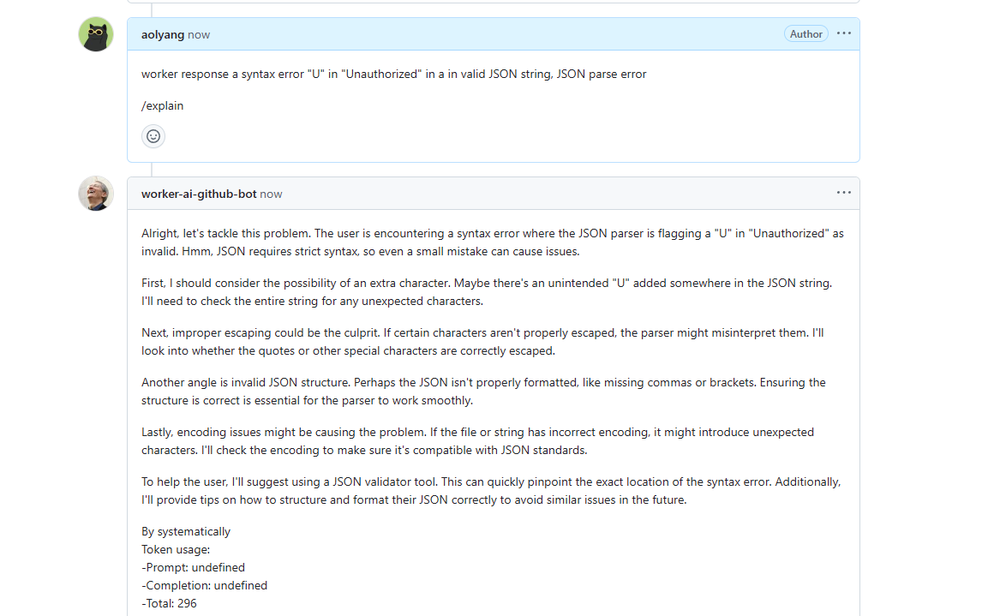

# Cloudflare worker AI for GitHub bot

+ a headless cloudflare worker use KV to store prompts, use Cloudflare AI to handle GitHub webhook events, for example:
  issue command
+ handle routes by [hono](https://hono.dev/)
+ use [hono-openapi](https://github.com/rhinobase/hono-openapi)
  and [zod-openapi](https://github.com/samchungy/zod-openapi#readme) (with zod) to define and validate query & params
  schema
+ use [hono-openapi](https://github.com/rhinobase/hono-openapi) (api specs) to generate
  api [schemas and docs](https://cloudflare-deepseek-code-reviewer.aolyang.workers.dev)
+ use [nextjs](https://nextjs.org/docs) to serve a nice interactive UI to operate Prompts
    + GitHub OAuth using [Next-Auth@v5](https://authjs.dev/getting-started)
    + Prompts Import/Export, Create/Update/Delete, Search Models, etc.
+ completely self-hostable, you can freely to deploy worker to your cloudflare account, and run Nextjs on your own
  server

*ps: prompt in example image below are not production usable, please add your own.

recommend site: [https://prompts.chat/](https://prompts.chat)

## A brief look

| unauthorized                                 | authorized                             |
|----------------------------------------------|----------------------------------------|
|  |  |

| update                                       | delete                                       |
|----------------------------------------------|----------------------------------------------|
|  |  |

| quick add from model list                   | filter models                                |
|---------------------------------------------|----------------------------------------------|
|  |  |

| completely api doc generated by openapi |
|-----------------------------------------|
|         |

| show result                         |
|-------------------------------------|
|  |

## online [home page](https://github-ai.aolyang.me) | [api doc](https://cloudflare-deepseek-code-reviewer.aolyang.workers.dev)

## dev & deploy guide

[English](./docs/deploy.md) | [简体中文](./docs/deploy.zh.md)