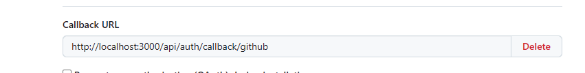
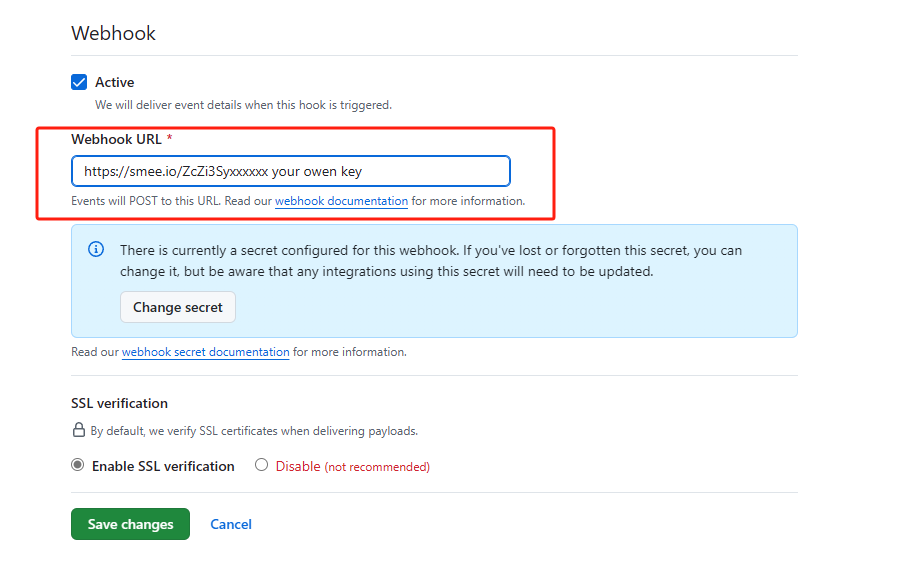
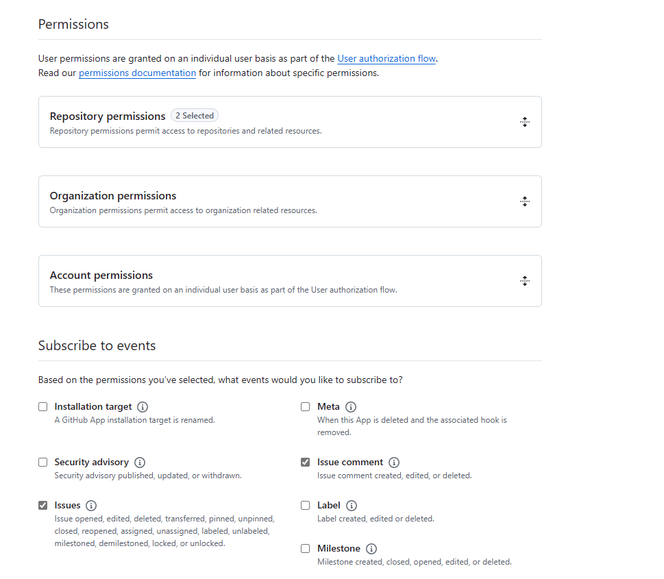

# deploy guide

## local development

### 1. fork/clone & install dependencies

```bash
git clone your-fork-url
# just for a look
git clone https://github.com/aolyang/cloudflare-deepseek-code-reviewer.git --depth=1
cd cloudflare-deepseek-code-reviewer

fnm use # if you use fnm as your node version manager
pnpm install # this project use pnpm workspace feature  
```

### 2. create a test purpose GitHub app

+ setup [next-auth](https://authjs.dev/getting-started/authentication/oauth?framework=next-js) callback url



this project auth.js v5, remember to setup GitHub ID and Secret in `.env.local`  
if you deploy to your server, you should setup `.env` file too.

```bash
AUTH_GITHUB_ID={CLIENT_ID}
AUTH_GITHUB_SECRET={CLIENT_SECRET}
```

+ GitHub webhook event can not post to localhost, go to [https://smee.io](https://smee.io) home page,
click **start a new channel** button


+ then you can get a private channel to receive GitHub webhook events,
add url to GitHub App



+ go to `worker/package.json`, you can see a command `proxy_hooks`,
this command run a smee proxy server, **you have to replace the url to your own**.

+ return to "setup new GitHub App", **select App permissions you need **



+ at the end, if you don't want share your api with others, remember to select "Only on this account" selection


+ not the end, after you create the GitHub App, back to setup page, generate a `Private Key` for verify webhook events' payload
about "how to verify", you can see the code in `worker/src/routes/github.ts`, also this [official webhook document](https://docs.github.com/en/webhooks/using-webhooks/validating-webhook-deliveries)

**there is a trap**, the `Private Key` is pkcs#1 format, so you need to use `openssl` to convert it to pkcs#8 format

```bash
openssl pkcs8 -topk8 -inform PEM -outform PEM -nocrypt -in your-private-key.pem -out out.pkcs8.pem
```

### 3. setup worker local dev environment

+ copy `.dev.vars.example` to `.dev.vars`

+ let's talk about envs one by one
    + `AUTH_TOKEN`: for worker api auth middleware, see `worker/src/middlewares/auth.ts`
    + `ACCOUNT_ID`: your cloudflare account id. when you login to cloudflare dashboard, it's in the url
    + `CLOUDFLARE_EMAIL`: your cloudflare email.
    + `CLOUDFLARE_API_KEY`: go to https://dash.cloudflare.com/profile/api-tokens `#API Keys` to create one
    + the rest is GitHub App settings:
```bash
GITHUB_APP_ID=
GITHUB_APP_OAUTH_CLIENT_ID=
GITHUB_APP_OAUTH_CLIENT_SECRET=
GITHUB_APP_WEBHOOK_SECRET=
# here is important, this is the pkcs#8 format private key you convert earlier
GITHUB_APP_PRIVATE_KEY= 
```

+ copy `wrangler.example.tomal` to `wrangler.toml`, and config kv namespace

```bash
npx wrangler kv namespace create prompts [OPTIONS]
```

update `wrangler.toml` name field

### 4. setup nextjs local dev environment (optional)

`base on step 2`, you need setup those envs in `.env.local` file

```bash
AUTH_SECRET= # generate by npx auth
AUTH_TOKEN=  # same as worker AUTH_TOKEN

API_URL= # your worker origin url
```

### 5. start dev server

```bash
# in code-review-admin directory
pnpm dev

# worker directory
pnpm proxy_hooks # start smee proxy server
pnpm dev         # start cloudflare local server
```

## deploy

it's only few difference between local dev and deploy


### 1. set environment variables to cloudflare

```bash
wrangler deploy # deploy your worker to cloudflare, remember to change 
```

then find worker (same name in `wrangler.toml`) in cloudflare dashboard, set environment variables


### 2. (optional) deploy nextjs app to your owen cloud

same as `.env.local` file, but in production, nextjs only pick up `.env` file

```bash
cd code-review-admin

cp .env.example .env
#... modify .env file
pnpm build
pm2 start "pnpm start -p 80" --name pm2-instance-name
```
more in `.env` file:
1. change `API_URL` to your public cloudflare worker url
2. Add `NEXTAUTH_URL` to your cloud public domain url

this deploy guide is more like a draft, any problem you can submit an issue, I will respond and update as quick as possible.