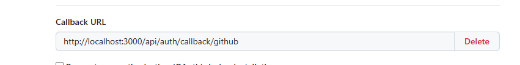
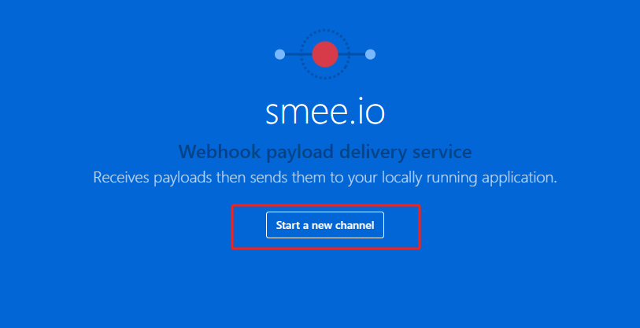
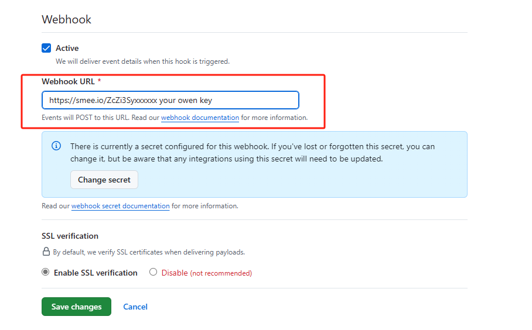
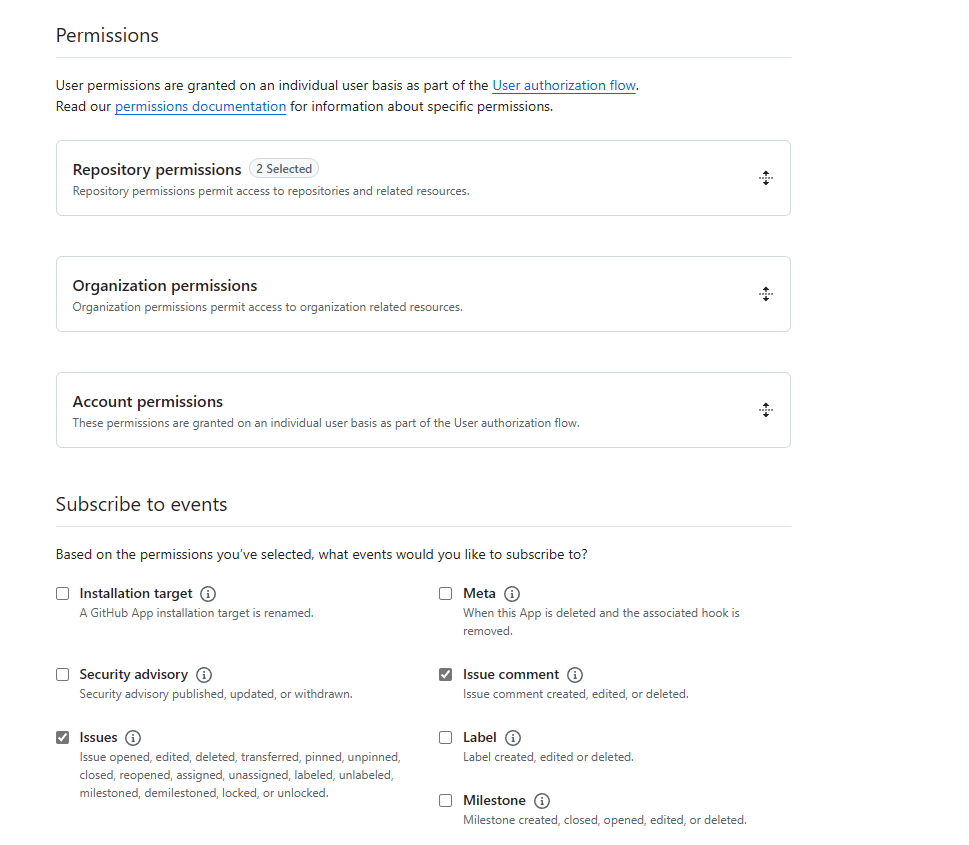
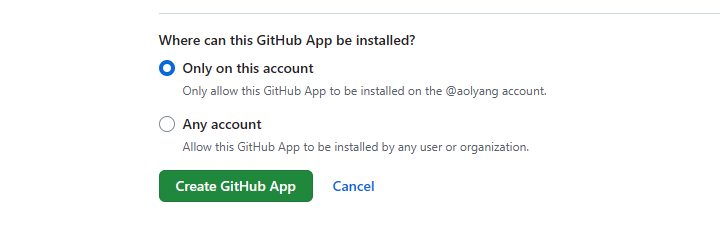
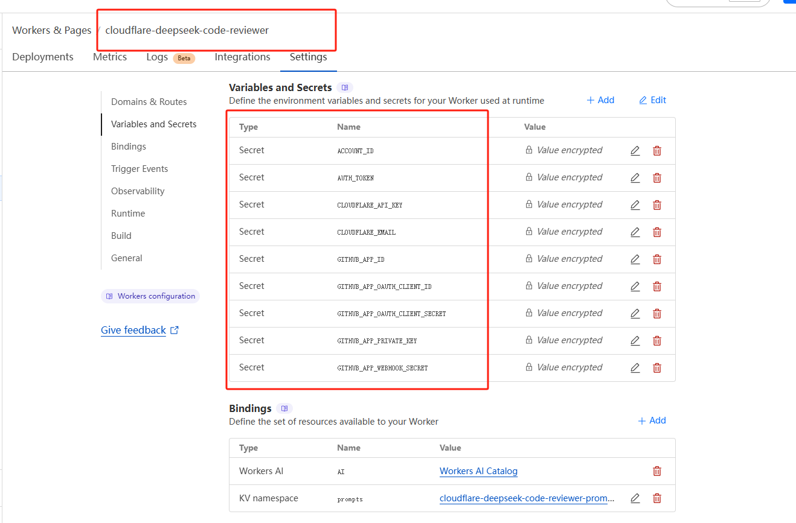

# 部署指南

（声明：由copilot workspace 帮助翻译）

## 本地开发

### 1. fork/clone & 安装依赖

```bash
git clone your-fork-url
# 如果简单调试
git clone https://github.com/aolyang/cloudflare-deepseek-code-reviewer.git --depth=1
cd cloudflare-deepseek-code-reviewer

fnm use # 如果你使用 fnm 作为你的 node 版本管理器
pnpm install # 这个项目使用 pnpm workspace  
```

### 2. 创建一个用于测试的 GitHub 应用

+ 设置 [next-auth](https://authjs.dev/getting-started/authentication/oauth?framework=next-js) 回调地址



这个项目基于 auth.js v5，需要在 `.env.local` 中设置 GitHub ID 和 Secret  
如果你将其部署到你的服务器，那你需要设置 `.env` 文件。

```bash
AUTH_GITHUB_ID={CLIENT_ID}
AUTH_GITHUB_SECRET={CLIENT_SECRET}
```

+ GitHub webhook 事件不能发布到 localhost， 访问[https://smee.io](https://smee.io) 首页，
点击 **start a new channel** 按钮创建一个代理地址



+ 然后你可以获得一个私有频道来接收 GitHub webhook 事件，
将 URL 添加到 GitHub 应用



+ 进入 `worker/package.json`，你可以看到一个命令 `proxy_hooks`，
这个命令运行一个 smee 代理服务器，**你必须将 URL 替换为你自己的**。

+ 返回到“设置新的 GitHub 应用”，**选择你需要的应用权限**



+ 最后，如果你不想与他人共享你的 API，记得选择“仅在此帐户上”选项



+ 还没完，创建 GitHub 应用后，返回设置页面，生成一个 `Private Key` 用于验证 webhook 事件的有效负载
关于“如何验证”，你可以查看 `worker/src/routes/github.ts` 中的代码，也可以查看这个 [官方 webhook 文档](https://docs.github.com/en/webhooks/using-webhooks/validating-webhook-deliveries)

**这里有一个陷阱**，`Private Key` 是 pkcs#1 格式的，所以你需要使用 `openssl` 将其转换为 pkcs#8 格式

```bash
openssl pkcs8 -topk8 -inform PEM -outform PEM -nocrypt -in your-private-key.pem -out out.pkcs8.pem
```

### 3. 设置 worker 本地开发环境

+ 复制 `.dev.vars.example` 到 `.dev.vars`

+ 让我们逐一讨论环境变量
    + `AUTH_TOKEN`：用于 worker API 认证中间件，见 `worker/src/middlewares/auth.ts`
    + `ACCOUNT_ID`：你的 cloudflare 账户 ID。当你登录到 cloudflare 仪表板时，它在 URL 中
    + `CLOUDFLARE_EMAIL`：你的 cloudflare 邮箱。
    + `CLOUDFLARE_API_KEY`：访问 https://dash.cloudflare.com/profile/api-tokens `#API Keys` 创建一个
    + 其余的是 GitHub 应用设置：
```bash
GITHUB_APP_ID=
GITHUB_APP_OAUTH_CLIENT_ID=
GITHUB_APP_OAUTH_CLIENT_SECRET=
GITHUB_APP_WEBHOOK_SECRET=
# 这里很重要，这是你之前转换的 pkcs#8 格式的私钥
GITHUB_APP_PRIVATE_KEY= 
```

+ 复制 `wrangler.example.tomal` 到 `wrangler.toml`，并配置 kv 命名空间

```bash
npx wrangler kv namespace create prompts [OPTIONS]
```

更新 `wrangler.toml` 中的 name 字段

### 4. 设置 nextjs 本地开发环境（可选）

`基于第 2 步`，你需要在 `.env.local` 文件中设置这些环境变量

```bash
AUTH_SECRET= # 由 npx auth 生成
AUTH_TOKEN=  # 与 worker AUTH_TOKEN 相同

API_URL= # 你的 worker 源 URL
```

### 5. 启动开发服务器

```bash
# 在 code-review-admin 目录中
pnpm dev

# worker 目录
pnpm proxy_hooks # 启动 smee 代理服务器
pnpm dev         # 启动 cloudflare 本地服务器
```

## 部署

本地开发和部署之间只有一些不同

### 1. 将环境变量设置到 cloudflare

```bash
wrangler deploy # 将你的 worker 部署到 cloudflare，记得更改 
```

然后在 cloudflare 仪表板中找到 worker（与 `wrangler.toml` 中的名称相同），设置环境变量



### 2.（可选）将 nextjs 应用部署到你自己的云

与 `.env.local` 文件相同，但在生产环境中，nextjs 只会读取 `.env` 文件

```bash
cd code-review-admin

cp .env.example .env
#... 修改 .env 文件
pnpm build
pm2 start "pnpm start -p 80" --name pm2-instance-name
```
更多在 `.env` 文件中：
1. 将 `API_URL` 更改为你的公共 cloudflare worker URL
2. 添加 `NEXTAUTH_URL` 到你的云公共域 URL

这个部署指南更像是一个草稿，任何问题你都可以提交一个 issue，我会尽快回复和更新。

